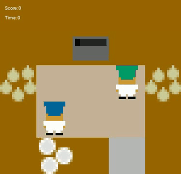
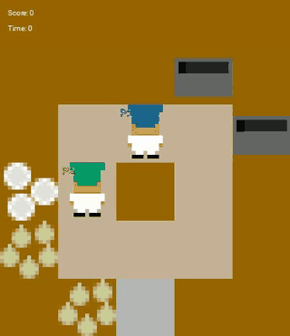
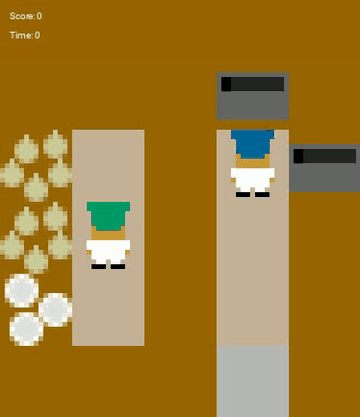
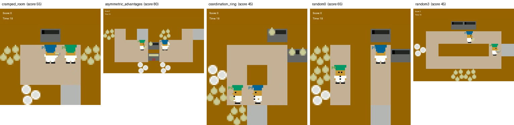

# Telemetry vs. Video: Comparing Automatic After-Action Reviews

Generates after-action reviews (AARs) of two-player [Overcooked](https://github.com/HumanCompatibleAI/overcooked_ai)
episodes two ways — from a structured event log, and from gameplay video —
then compares where the two accounts disagree.

**The question:** telemetry knows exactly what happened but not what it
looked like. Video sees hesitation, near-misses, and repeated blocked
attempts that never become discrete logged events. Neither is complete. Where
do they diverge, and which should you trust for which kind of claim?

## Demo

Real human-human episodes from the 2019 study, rendered straight from the
bundled action logs — no screen recording involved.

<p align="center">
  
  
  
</p>

All five layouts in the dataset:



The same episode as the telemetry model sees it — a natural-language event
timeline extracted from ~1,200 timesteps of raw state
([full file](docs/demo/cramped_room_timeline.txt)):

```text
Layout: cramped_room
Episode length: 1204 timesteps
Final score: 55

Timeline:
  t=   3.0s  Player 2 tried to move forward but was blocked.
  t=   4.8s  Player 1 had no item interaction for 31 steps.
  t=   5.4s  Player 1 picked up onion.
  t=   8.1s  Player 1 put down onion.
  t=  15.8s  Player 1 picked up dish.
  t=  22.1s  Soup delivered (+5 points).
  t=  22.4s  Player 2 put down onion.
  ...
```

More: [asymmetric_advantages](docs/demo/asymmetric_advantages.gif) ·
[random3](docs/demo/random3.gif) · timelines in [`docs/demo/`](docs/demo/).

## Pipeline

```
bundled human trials ──┬── StateVisualizer ──> mp4 ────> Video-LLM ──> AAR (video)
                       │                                                  │
                       └── event extraction ──> timeline ──> LLM ──> AAR (telemetry)
                                                                          │
                                                       comparison pass ───┘
                                                               │
                                                     blind human rating
```

## Quick start

```bash
git clone https://github.com/khalequzzamanlikhon/overcooked_AAR
cd overcooked_AAR
bash run.sh
```

`run.sh` creates a venv, installs dependencies, and picks a backend
automatically:

| Condition | Backend |
|---|---|
| CUDA GPU available | Local Qwen2.5-VL (no API keys, nothing leaves the box) |
| No GPU, `GROQ_API_KEY` + `GOOGLE_API_KEY` set | Groq (text) + Gemini (video) — both have free tiers, no subscription needed |
| Neither | Render videos and timelines only |

Check everything works before downloading any model:

```bash
BACKEND=none bash run.sh
```

### Options

```bash
GPU=1 bash run.sh                                # pin to cuda:1
LAYOUT=all N_TRIALS=4 bash run.sh                # all five layouts
MODEL=Qwen/Qwen2.5-VL-3B-Instruct bash run.sh    # smaller local model
BACKEND=api bash run.sh                          # force API backend
```

### Without `run.sh` (e.g. Windows)

```bash
pip install -r requirements.txt
python run_pipeline.py --layout cramped_room --n-trials 6 --out out --no-llm
python run_pipeline.py --layout all --n-trials 4 --backend api
```

VRAM (bf16): 3B ≈ 8 GB, 7B ≈ 17 GB, 32B ≈ 70 GB. If you OOM mid-run, lower
`LLMConfig.max_pixels` or raise `RenderConfig.subsample` first — video frames
dominate activation memory, not weights.

## Outputs

| Path | Contents |
|---|---|
| `out/report.md` | Every AAR pair, readable |
| `out/results.json` | Structured, checkpointed per trial |
| `out/videos/` | Rendered gameplay mp4s |
| `out/timelines/` | Event timelines fed to the model |

Then rate the AARs blind (source hidden and shuffled):

```bash
python rate_aars.py --results out/results.json
```

Regenerate the demo assets above:

```bash
python run_pipeline.py --layout all --n-trials 1 --out out_all --no-llm
python scripts/make_demo_assets.py --run out_all --out docs/demo
```

## Data

Ships with the `overcooked-ai` package — 39 train and 37 test trials of real
human-human play across five layouts (`cramped_room`, `asymmetric_advantages`,
`coordination_ring`, `random0`, `random3`), final scores ranging 40–205.
Nothing to download.

## Notes

Things that break if you write this from scratch, all handled here:

1. **The bundled pickles won't load under pandas 2.x** — they reference
   `pandas.core.indexes.numeric`. `data_loader` registers a stub module.
2. **`OvercookedState.from_dict` fails on the 2019 state format** —
   `state_convert.convert_old_state` rebuilds objects and soups.
3. **Naive blocked-move detection counts every turn as a block** — pressing a
   direction you aren't facing turns you in place, so the extractor only
   counts presses that match the current orientation.
4. **Two layouts were renamed** in the current package: `random0` →
   `forced_coordination`, `random3` → `counter_circuit_o_1order`.
   `render_video` maps them.
5. **Headless rendering** needs `SDL_VIDEODRIVER=dummy` (set automatically).

Most of the output quality comes from `aar/telemetry_to_text.py`, not the
prompts. An LLM can't reason over 1,200 rows of coordinates; it reasons over
events.

## Citation

Carroll, M., Shah, R., Ho, M. K., Griffiths, T. L., Seshia, S. A., Abbeel, P.,
Dragan, A. *On the Utility of Learning about Humans for Human-AI
Coordination.* NeurIPS 2019.
