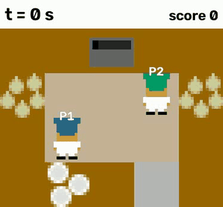
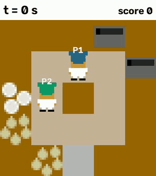
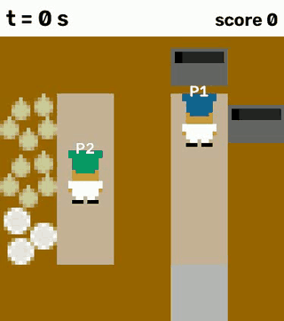
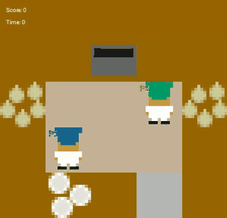
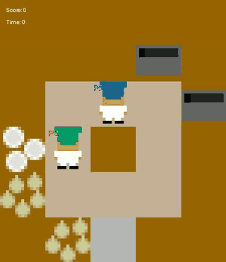
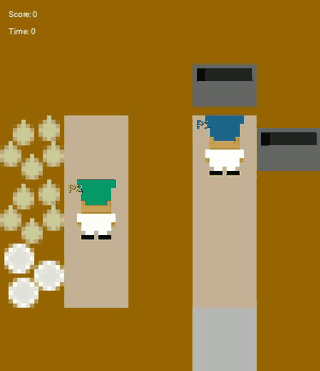
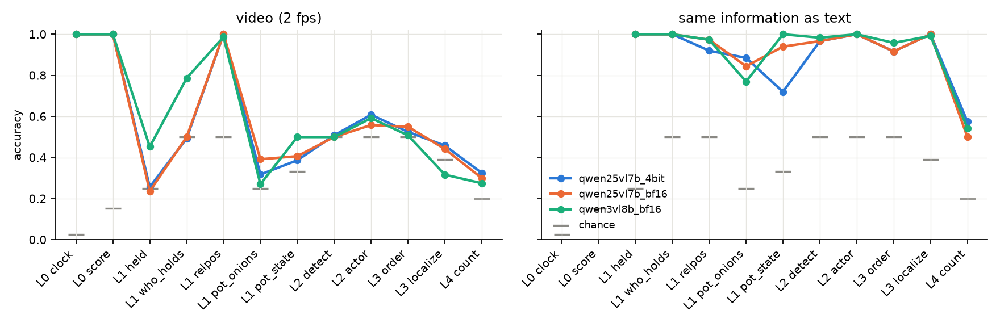

# Telemetry vs. video: comparing automatic after-action reviews

**Status:** the pilot (two runs) and study v2 are done on the pilot's 15 episodes:
three model settings, seven input conditions, a perception probe and a
sampled-decoding repeat. The short version: from the event log the models make claims
that check out (67-93% precision); from video their claims are at chance, and neither
a readable render, full precision nor a newer model changes that. The probe shows why:
the models read the clock and the score perfectly but can't see what a chef is holding
or whether a soup was delivered. Still to do: the other 61 episodes and the blind human
rating. See [Study v2: results](#study-v2-results).

After a team plays, an after-action review says what they did well, what cost them
time, and what to change. I wanted to know whether a model writes a better review
from the game's event log or from watching the gameplay video. The log knows exactly
what happened, but the video might show things the log never lists, like hesitation
or a near-miss.

So I gave the *same* model the *same* episode in two forms, asked it the same
questions, and checked every claim it made against the log.

## Demo

These are real human-human episodes from the 2019 Overcooked study, rendered from the
bundled action logs at the speed they were played, with the clock and player labels
on screen.

**Current render** (used for [`results/pilot_2026-09b/`](results/pilot_2026-09b/) and study v2):
large clock strip, white outlined P1/P2 labels.

<p align="center">
  
  
  
</p>

**First render** (used for [`results/pilot_2026-09/`](results/pilot_2026-09/)), kept
for comparison: the same episodes, with the clock in ~8 px text at the top left and
the labels drawn in the hat colour on top of the hat. Both were close to unreadable
for the model.

<p align="center">
  
  
  
</p>

And this is what the model reads in the log condition for the same episode: events I
extract from about 1,200 timesteps of raw game state
([full file](docs/demo/cramped_room_timeline.txt)):

```text
Layout: cramped_room
Episode length: 181 s. This is seconds 0-60.
Final score for the whole episode: 55

Event log:
  t=   5.4s  P1 picked up an onion.
  t=   5.6s  P1 tried to move into P2 and was blocked for 0.8 s.
  t=   8.1s  P1 put an onion in the pot.
  ...
  t=  14.1s  A pot started cooking (3 onions).
  t=  17.0s  A soup finished cooking.
  t=  18.0s  P1 filled a dish with soup.
  t=  22.2s  P1 delivered a soup.
  ...
```

(That is the pilot's header. Study v2 drops the episode length and the final score;
see [what the audit found](#what-the-audit-found).)

## How it works

```
human game logs ─┬─ render in real time ─── 60 s clips ──> Video LLM ─┐
                 │                                                    ├─> claims (JSON) ──> review
                 └─ extract events ──────── 60 s windows ─> same model ┘        │
                                                                               ├─> checked against the log
                                                                               └─> blind human rating (planned)
```

The choices the comparison depends on:

| | |
|---|---|
| One model per comparison | Every condition in a run uses the same model and precision, so a difference comes from the input, not the model. |
| One prompt | The wording is the same for every condition; only the block that names the source changes ([`aar/prompts.py`](aar/prompts.py), versioned by hash). |
| One minute at a time | Every source is read in 60 s windows, so each gets the same number of chances to make a claim. A 60 s clip at 2 fps also fits in the model's context. |
| Claims first, review second | First the model lists claims (time, player, type, text). Then it writes the review from those claims only. I can check a claim; I can't check a paragraph. |
| Real time, labelled | The video plays at the speed it was played, with the episode clock and P1/P2 drawn on screen, so "P1" means the same player in every condition. |

## Getting the log right first

The comparison only means something if the log condition is fed the truth. My first
version had three bugs, which I found by checking the events against the raw data
(a fourth, the last minute ending at 180 s, is described under the pilot results):

1. **Action timing.** The action at step `t` moves the player from `t` to `t+1`, not
   from `t-1` to `t`. Matched the wrong way, most real moves looked like failed ones.
2. **Blocked moves.** A move is blocked only when the teammate is standing on the tile
   you tried to enter. I was also counting presses into a counter, which is simply how
   you use a counter, so the log was full of fake "blocked" events.
3. **Dropped deliveries.** When a timeline got long, I kept every Nth event, which
   threw away most deliveries, and deliveries are the score. Now nothing is dropped,
   and `tests/test_events.py` checks that the number of deliveries always matches the
   final score.

## Experiments so far

Both pilot runs use Qwen2.5-VL-7B-Instruct (4-bit, greedy) on the same 15 episodes
(3 per layout, spread across the score range): 45 one-minute windows per condition
and 239 real deliveries. Three conditions: the event log (`telemetry`), the video at
2 fps (`video_dense`) and the video at 1 frame per 3 s (`video_sparse`). At most 8
claims per minute.

### Pilot 1: [`results/pilot_2026-09/`](results/pilot_2026-09/)

The first run. In its video the P1/P2 labels were drawn in the hat colour on top of
the hat, and the clock was ~8 px text. Both were close to unreadable, and the last
minute stopped at 180 s, losing the final 0.6 s of each episode (one delivery in
total). 98% of the video timestamps landed on a 5 s grid.

### Pilot 2: [`results/pilot_2026-09b/`](results/pilot_2026-09b/)

The rerun with white outlined labels, a large clock strip and the last minute
running to the end. Same episodes, model, precision and prompts. These are the
numbers from the pilot's checker (each claim matched to its nearest event on its
own; `python analyze.py --run results/pilot_2026-09b --legacy-only` reproduces them
exactly):

| condition | claims | supported | supported, naming a player | contradicted | wrong time | names a player | timestamp on a 5 s grid | delivery count error |
|---|---|---|---|---|---|---|---|---|
| log (`telemetry`) | 320 | **77%** | 77% | 3% | 20% | 97% | 2% | 2.40 |
| video, 2 fps (`video_dense`) | 395 | **48%** | 44% | 14% | 38% | 89% | 63% | 3.19 |
| video, 1 frame / 3 s (`video_sparse`) | 322 | **51%** | 50% | 8% | 41% | 92% | 42% | 4.20 |

*supported*: an event of that kind, by that player, within 3 s of the claimed time.
*wrong time*: that player did it in that minute, but more than 3 s away.
*contradicted*: that player did no such thing in that minute.

A supported rate needs a baseline: in a busy minute, a claim like "P1 picked up an
onion" lands within 3 s of some real pickup fairly often by luck alone. So I checked
the same claims again twice: once with each time moved to a random moment in its
minute, and once with P1 and P2 swapped.

| condition | supported | supported at a random time | not contradicted | not contradicted, P1/P2 swapped |
|---|---|---|---|---|
| log | 77% | 45% | 97% | 62% |
| video, 2 fps | 48% | **48%** | 84% | **80%** |
| video, 1 frame / 3 s | 51% | **51%** | 92% | **82%** |

What the pilot found:

- **The log beats the video, 77% to 48%.** And the log's timing is real: it scores
  32 points above its random-time baseline.
- **The video model's timestamps carry no information.** Its claims score exactly
  what they would at a random time in the minute, in both video settings and in both
  runs (53% vs. 52% in the first run). It knows roughly what kinds of things happen
  in a minute of Overcooked, not when they did.
- **Its player names carry little more.** Swapping P1 and P2 barely changes the
  video claims (84% → 80% not contradicted), while the log's claims fall apart
  (97% → 62%).
- **A readable clock changed the timestamps, not their accuracy.** With the clock too
  small to read, 98% of video timestamps landed on a 5 s grid; with a large clock
  strip, 63% (20% by chance). The model now uses the clock more, but its times still
  don't line up with events.
- **Neither counts well, and video is worse.** At 2 fps the model under-counted
  deliveries in 37 of 42 minutes it answered, and in all 45 at 1 frame per 3 s.
- **Fewer frames don't help.** 51% at 1 frame per 3 s against 48% at 2 fps, both at
  their random-time baselines.
- **What the model claims follows the source.** From the log it mostly claims
  deliveries (233 of 320); from sparse video mostly pickups (200 of 322).
- **The runs are repeatable.** Decoding is greedy, and for the log condition the
  first two minutes of every episode produced identical claims in both runs.

### Both pilots re-scored with the study-v2 checker: [`results/v2/rescored/`](results/v2/rescored/)

Before running anything new, I re-scored the pilots' existing claims with the stricter
checker study v2 uses ([`aar/metrics.py`](aar/metrics.py)). No model was rerun. What
changed in the checker:

- **One-to-one matching.** Each real event can back only one claim (Hungarian matching
  on the time gap). Before, "P1 delivered at 44 s" and "P1 delivered at 46 s" could both
  be supported by one delivery at 45 s; 46 of the 596 supported claims in pilot 2 were
  like that.
- **Recall.** The share of real events some claim was matched to, and the ceiling the
  8-claim cap allows.
- **Actor accuracy.** For claims that match a real event when the player is ignored:
  was the named player right? Compared with what independent guessing would score.
- **Time error**, the tolerance curve (supported rate at 0.5 to 10 s, each against its
  random-time baseline), output-collapse counts, and a fact-check of the written review.
- **Picking up soup from a pot is no longer a "pickup"**; "both"/"unclear" claims get
  their own row.
- **95% confidence intervals everywhere**, from resampling whole episodes (10,000 draws),
  and paired tests between conditions on the same episodes.

Pilot 2, re-scored ([full tables](results/v2/rescored/pilot_2026-09b/metrics_v2.md)):

| condition | precision | delivery recall | actor accuracy (chance) | median time error | above-chance area | says "1 delivery" |
|---|---|---|---|---|---|---|
| log | 69% [64, 73] | 62% [53, 73] | 81% [74, 88] (53%) | 0.7 s | 0.208 | 11% |
| video, 2 fps | 40% [31, 49] | 24% [17, 33] | **49% [44, 54] (50%)** | 2.4 s | **0.003** | 38% |
| video, 1 frame / 3 s | 47% [37, 56] | 18% [11, 25] | 53% [45, 61] (51%) | 1.8 s | 0.034 | 84% |

*above-chance area*: the mean gap between the supported rate and its random-time
baseline over tolerances from 0.5 to 10 s. Zero means the timestamps carry no information.

What the re-scoring adds:

- **Every rate drops once an event can only be used once** (log 77% → 69%, video
  48% → 40%), and the gap stays: log minus video is +29 points [+18, +39], p = 0.0001
  (Wilcoxon, 15 episodes).
- **The video model's player names are coin flips.** When a video claim matches a real
  event, the player it names is right 49% of the time, against 50% by chance. From the
  log: 81% against 53%.
- **Its timing is at chance at every tolerance,** not just at 3 s: the area between its
  tolerance curve and the random-time curve is 0.003 (log: 0.208).
- **It misses most deliveries.** The log condition finds 62% of real deliveries; the
  video condition 24% at 2 fps and 18% at 1 frame per 3 s.
- **The output has a fixed pattern.** At 2 fps, 74% of the minutes with four or more
  named claims alternate P1, P2, P1, P2 strictly. It says "1 delivery" in 38% of
  minutes at 2 fps and 84% at 1 frame per 3 s, and under-counts by 2.9 and 4.2 soups
  per minute on average.
- **Pilot 1 tells the same story** ([tables](results/v2/rescored/pilot_2026-09/metrics_v2.md)):
  video precision 48% against a random-time 44%, actor accuracy 56% against 50%.

### What the audit found

Going through the code before study v2 turned up two problems with the pilot's inputs
and scoring, which v2 fixes:

1. **The log prompt gave away the final score.** Only the log condition's header said
   `Final score for the whole episode`, and the score says how many soups went out. In
   minute 3 the log condition answered "10 deliveries" for 7 of the 15 episodes. v2
   leaves it out (`events_to_timeline(..., pilot_header=True)` brings it back).
2. **The video shows the running score.** The strip above the grid shows the score on
   every frame, so reading the score at the start and end of a minute would give that
   minute's deliveries. The model didn't use it: it under-counted anyway. The probe
   now tests this directly, with and without the score on screen.

Plus the matching problem above (one event backing two claims) and the lenient
"both"/"unclear" and pickup rules.

## Limitations

- **Small sample.** 15 episodes (45 minutes of play per condition), all from the train
  split, one prompt. The other 61 episodes are set up
  (`PHASES="all analyze" bash run_study.sh`) but not run.
- **Small models.** Two open 7-8B models. A larger or a closed video model may do
  better; nothing here says video models in general can't do this.
- **No human rating yet.** Everything reported is the automatic check against the log.
- **Same information.** The video is drawn from the same game state as the log, so it
  cannot contain anything the state lacks. What it can show is behaviour the *event
  log* doesn't list (waiting at a pot, a handoff over a counter). Study v2 checks those
  against behaviours computed from the raw state. "Video shows things telemetry can't"
  can't be tested on this data.
- **The check only covers what the state records.** Claims about coordination or
  strategy are left to the human rating.
- **Vague claims are easier to support.** "Both players picked up an onion" matches
  whoever did it, so "both"/"unclear" claims are reported separately.
- **Rendered sprites, no audio, 2019 data.** This is not video of real people.

## Study v2: results

Run on 28-30 September 2026, 49 hours on the two shared A5000s: three model settings,
the pilot's 15 episodes in every condition, the perception probe (1,646 items from all
76 episodes) and the sampled-decoding repeat. **Not run yet:** the other 61 episodes
(the `all` step) and the blind human rating. Full tables:
[`results/v2/SUMMARY.md`](results/v2/SUMMARY.md), one `metrics_v2.md` per model under
[`results/v2/`](results/v2/), and [`results/v2/probe/probe_summary.md`](results/v2/probe/probe_summary.md).

### Claims, by model and condition

The pilot's 15 episodes, at most 20 claims per minute, greedy decoding. Brackets are
95% CIs from resampling episodes.

| model | condition | precision | delivery recall | actor accuracy | above-chance area |
|---|---|---|---|---|---|
| Qwen2.5-VL-7B, 4-bit | log | 67% [62, 71] | 71% [57, 83] | 80% [74, 85] | 0.131 |
| | video, 2 fps | 30% [22, 38] | 13% [8, 19] | 61% [52, 69] | -0.075 |
| | video, 1 frame / 3 s | 22% [14, 32] | 8% [4, 12] | 58% [49, 67] | -0.030 |
| | video + log | 68% [64, 72] | 67% [57, 76] | 86% [81, 90] | 0.133 |
| | raw state as text | 24% [16, 32] | 20% [13, 28] | 65% [58, 71] | -0.121 |
| Qwen2.5-VL-7B, bf16 | log | 69% [64, 74] | 76% [67, 85] | 82% [76, 87] | 0.154 |
| | video, 2 fps | 34% [27, 41] | 27% [18, 35] | 56% [50, 63] | -0.136 |
| | video, 1 frame / 3 s | 34% [26, 42] | 13% [8, 18] | 53% [48, 59] | -0.164 |
| | video + log | 67% [61, 73] | 74% [62, 85] | 84% [75, 90] | 0.174 |
| | raw state as text | 35% [24, 49] | 18% [9, 28] | 76% [66, 85] | -0.108 |
| Qwen3-VL-8B, bf16 | log | **93% [92, 95]** | **98% [96, 100]** | 99% [98, 100] | 0.320 |
| | video, 2 fps | 43% [32, 53] | 16% [4, 32] | 58% [51, 69] | -0.093 |
| | video, 1 frame / 3 s | 37% [26, 50] | 6% [2, 12] | 53% [51, 56] | -0.128 |
| | video + log | 96% [94, 97] | 62% [36, 89] | 99% [98, 100] | 0.318 |
| | raw state as text | 49% [40, 58] | 47% [38, 57] | 68% [62, 73] | 0.023 |

Actor accuracy is 50% by chance. The `blind` condition (no input at all) finds 0-3% of
the real events in every model; it is in the full tables.

### The probe: video against the same information as text

| question | chance | Qwen2.5 4-bit, video | Qwen2.5 bf16, video | Qwen3, video | text (all three) |
|---|---|---|---|---|---|
| what does the clock show / what is the score | 3% / 15% | 100% | 100% | 100% | - |
| is P1 left or right of P2 | 50% | 100% | 100% | 99% | 92-97% |
| what is P1 holding | 25% | 26% | 24% | 45% | 100% |
| who holds the item | 50% | 49% | 50% | 79% | 100% |
| how many onions in the pot | 25% | 32% | 39% | 27% | 77-89% |
| is the soup cooking or ready | 33% | 39% | 41% | 50% | 72-100% |
| did P1 deliver a soup (5 s clip) | 50% | 51% | 50% | 50% | 97-98% |
| who delivered it | 50% | 61% | 56% | 59% | 100% |
| which of two events came first | 50% | 52% | 55% | 51% | 92-96% |
| when was the soup delivered (within 3 s) | - | 46% | 44% | 32% | 99-100% |
| how many soups were delivered | 20% | 32% | 30% | 28% | 50-57% |

<p align="center">
  
</p>

### What study v2 found

- **RQ1, where the video fails: at seeing objects and detecting events.** All three
  models read the clock and the score perfectly and know which chef is on which side.
  They cannot tell what a chef is holding (24-26% for Qwen2.5 against 25% by chance) or
  whether a delivery happened in a 5 s clip (50-51% against 50%). Given the same
  information as text they score 97-100% on those questions. So the failure is
  perception, and everything later (order, time, counting) fails because of it.
- **More frames and a clock help placing an event in time, not seeing it.** For
  Qwen2.5 4-bit, the delivery time is within 3 s for 30% of items at 1 frame per 3 s
  and 62% at 4 fps, but detection stays at 50-57%. Taking the clock strip away costs
  Qwen3 half of its time accuracy (32% → 17%): the models lean on the clock.
- **RQ2, a better model does not fix it.** bf16 against 4-bit changes nothing I can
  measure on the log (+3 points [-3, +9]) and little on video. Qwen3-VL is much better
  at reading the log (precision +24 points [+20, +29], p = 0.00006) and a little better
  at single frames (what a chef holds: 45%; who holds the item: 79%), but its video
  claims are no better than Qwen2.5's (+10 points [-7, +24], p = 0.42), its event
  detection is still 50%, and its timestamps are still below the random-time baseline.
- **RQ3, the log is what works, and video adds nothing to it.** Log plus video scores
  what the log alone scores in all three models. For Qwen3 it finds fewer deliveries
  than the log alone (62% against 98%, difference -36 points [-62, -8], p = 0.10) and
  13 of its minutes failed to parse.
- **The raw state as text is almost as bad as video.** Same information as the video,
  as text, with no events extracted: 24-49% precision, against 67-93% for the event
  log. So a large part of the gap is not pixels against text but raw against
  summarised: the models can't turn two state dumps a second into events either.
- **Video is not clearly better than no input.** For Qwen3, 2 fps video beats `blind`
  by +7 points of precision [-8, +24] and finds 5% of the real events against 0%.
- **RQ4, no model recovers the behaviours the log doesn't list.** Waiting, handoffs
  and congestion are almost never claimed and almost never right, in any condition
  (Qwen3 from video: 1 supported out of 17 such claims, recall 0%).
- **RQ5, better claims make better reviews, up to a point.** In Qwen3's written
  reviews, 28% of the timed statements from the log are wrong against 59-67% from
  video. But 21% are wrong even from the oracle's perfect claims, so the writing stage
  adds mistakes of its own. The human rating is still to do.
- **Video numbers move a lot between runs; log numbers don't.** Over 3 sampled seeds
  the log's precision has a standard deviation of 1.0-2.6 points, the video's 5.5-10.6.
  For Qwen2.5 bf16 the sampled video runs average 52% against 34% greedy, so a single
  video number should be read with that in mind. The log against video gap is far
  larger than this spread.
- **Counting follows the same split.** Qwen3 is off by 0.9 deliveries per minute from
  the log and by 3.3 from 2 fps video, almost always under-counting.

### Against the pilot

Same episodes and the same Qwen2.5-VL 4-bit setting as pilot 2, but 20 claims per
minute instead of 8, the new prompt and no final score in the log header, so the
numbers are close but not identical: log precision 69% → 67%, 2 fps video 40% → 30%,
video timing at chance in both. Nothing in v2 contradicts the pilot; it explains it.

## Study v2: design

Code on branch `study-v2`; the pilot's state is tagged `pilot-v1`.

**The fact the design depends on:** video and log hold the same information. So any
gap between them comes from *perception, placing things in time, or abstraction*,
not from missing information. The questions:

| | Question | Answered by |
|---|---|---|
| RQ1 | Where does reading the video fail: seeing, detecting, placing in time, or counting? | the perception probe |
| RQ2 | Does a better model fix it? (4-bit vs bf16; Qwen2.5-VL vs Qwen3-VL, which puts timestamps between video frames) | the same pipeline on both models |
| RQ3 | What does the event log add, and does adding video to it help or hurt? | the seven conditions |
| RQ4 | Can a model recover behaviour the event log doesn't list but the raw state implies? | derived behaviours |
| RQ5 | Do better claims make better reviews? | review fact-check, blind human rating |

### Models

Only these two models, three settings:

| tag | model | precision | why |
|---|---|---|---|
| `qwen25vl7b_4bit` | Qwen2.5-VL-7B-Instruct | 4-bit NF4 (~6 GB) | the pilot model; the direct link back to the pilot |
| `qwen25vl7b_bf16` | Qwen2.5-VL-7B-Instruct | bf16 (~17 GB) | did 4-bit quantisation hurt? |
| `qwen3vl8b_bf16` | Qwen3-VL-8B-Instruct | bf16 (~17 GB) | text timestamps between video patches: does that fix the timing? |

4-bit runs on whichever GPU has more free memory; bf16 is spread over both cards.

### Conditions

Same model, same two stages, same wording; only the source block of stage 1 changes.

| condition | stage 1 reads | what it tells us |
|---|---|---|
| `blind` | nothing but the layout and the minute | what the model claims from its priors alone; the floor video has to beat |
| `telemetry` | the event log | the log, as in the pilot (without the final score) |
| `video_dense` | the clip at 2 fps | the video, as in the pilot |
| `video_sparse` | the clip at 1 frame / 3 s | fewer frames |
| `video_log` | the clip and the event log | does video add to the log or distract from it? |
| `state_text` | the raw state as text, twice a second | same information as the video, as text, with no events extracted: separates "pixels vs. text" from "raw vs. summarised" |
| `oracle` | (no stage 1) the true events | the review written from perfect claims: how many mistakes stage 2 adds by itself |

Other changes from the pilot: at most **20** claims per minute (8 capped recall far below
the number of events), no final score in any stage-1 prompt, and three new claim types
(`waiting`, `handoff`, `congestion`) that can be checked against derived behaviours.

### Perception probe (RQ1)

1,646 short questions ([`probes/probe_v1.jsonl`](probes/probe_v1.jsonl)) built from all
76 episodes, every answer computed from the state log, balanced where the answer is a
class:

| level | question | input |
|---|---|---|
| L0 reading | what does the clock show; what is the score | 1 frame |
| L1 one frame | what is P1 holding; who holds the onion; is P1 left or right of P2; how many onions in the pot; is a soup cooking or ready | 1 frame |
| L2 detection | did P1 deliver a soup; who delivered it | 5 s clip |
| L3 time | which of two events came first; at what time was the soup delivered | 10 s / 15 s clip |
| L4 counting | how many soups were delivered | 10 / 30 / 60 s clip |

Every item from L1 up is also asked with the same information as **text** (the state
described in words, or the event log of the clip). If text is right and video is
wrong, the failure is perception. Ablations on the clip questions: 1/3, 1, 2 and 4
fps; the strip above the grid with clock and score, clock only, or nothing.

### Derived behaviours (RQ4)

Computed from the raw state ([`aar/behaviors.py`](aar/behaviors.py)), never shown to the
log condition. The thresholds are frozen, and the tables also report them at 0.5x
and 1.5x:

| behaviour | definition |
|---|---|
| waiting | a player stands still facing a pot for 2 s or more while its soup cooks |
| handoff | one player puts an item on a counter and the other picks it up within 10 s |
| congestion | the players stand side by side, both within 2 squares of the same station, for 1.5 s or more |

### Metrics

Per run, per condition, all with 95% episode-bootstrap CIs
([`aar/metrics.py`](aar/metrics.py), [`aar/stats.py`](aar/stats.py),
[`aar/report_v2.py`](aar/report_v2.py)): precision, recall (and its ceiling), F1 per
claim type, delivery recall, actor accuracy against chance, median time error, the
tolerance curve against its random-time baseline, the P1/P2 swap, delivery-count
error, output collapse (5 s grid, repeated minutes, strict P1/P2 alternation, "says
1"), clip-relative timestamps (would the claim be right as seconds since the clip
started?), and a fact-check of each written review (delivery counts and timed events,
[`aar/aar_check.py`](aar/aar_check.py)). Paired differences between conditions and
between models on the same episodes, with Wilcoxon tests. A sampled-decoding repeat
(3 seeds, pilot episodes, log and 2 fps video) shows how much the numbers move.

### Running it

```bash
bash run_study.sh              # starts in the background, prints the log path, returns
tail -f logs/latest.log        # watch it
bash run_study.sh --status     # which step it is on
bash run_study.sh --stop       # stop it; run it again later and it resumes
```

It runs these steps in order, each one resumable (finished episodes, conditions and
probe items are skipped on a rerun):

| step | what | GPU |
|---|---|---|
| `setup` | install requirements, run the tests | - |
| `rescore` | re-score both pilots with the v2 checker → `results/v2/rescored/` | - |
| `probe_build` | build the probe items (kept if they exist) | - |
| `smoke` | per model: 1 minute of 1 episode in every condition and 20 probe items; a model that fails is skipped | yes |
| `pilot` | per model: the pilot's 15 episodes, every condition → `results/v2/<model>/` | yes |
| `probe` | per model: every probe item, every variant → `results/v2/probe/<model>/` | yes |
| `all` | per model: the other 61 episodes | yes |
| `analyze` | tables and figures per run, probe tables, cross-model summary → `results/v2/SUMMARY.md` | - |
| `variance` | per model: 3 sampled-decoding seeds on the pilot episodes → `results/v2/variance/` | yes |

Options are environment variables, e.g. `MODELS="qwen3vl8b_bf16" PHASES="probe pilot analyze" GPUS=1 bash run_study.sh`.
The whole study is about **5-6 days of GPU time** on the two shared A5000s (measured
timings in [`results/README.md`](results/README.md)). The pilot phase comes before
`all` for every model, so the results comparable with the pilot arrive first, after
about a day.

The blind human rating is by hand, after the runs:

```bash
# one file per rater; --likert adds 1-5 scores for times, players, completeness and insight
python rate_aars.py --run results/v2/qwen3vl8b_bf16 --rater r1 --pairs telemetry:video_dense,video_dense:video_log --likert
python analyze.py --run results/v2/qwen3vl8b_bf16    # adds votes, Krippendorff's alpha, source-guess accuracy
```

## Run it

```bash
git clone https://github.com/khalequzzamanlikhon/overcooked_AAR && cd overcooked_AAR
bash run_study.sh                # the whole study, in the background
bash run.sh                      # one model, the pilot's 15 episodes, in the foreground
NO_LLM=1 bash run.sh             # no GPU: render the videos and event logs only
python -m pytest tests -q
```

The 7B model in 4-bit needs about 10 GB of free VRAM; bf16 about 17 GB plus room for
the video. A 60 s clip at 2 fps is about 10k visual tokens, which is why the video is
split into minutes.

## Repository

| path | what |
|---|---|
| `aar/telemetry_to_text.py` | events from the raw state; the event log text |
| `aar/behaviors.py`, `aar/state_text.py` | derived behaviours; the raw state as text |
| `aar/render_video.py` | real-time video, single frames and clips |
| `aar/prompts.py`, `aar/generate_aar.py`, `aar/vlm_local.py` | prompts, the two stages, the Qwen2.5-VL / Qwen3-VL backend |
| `aar/verify.py` | the pilot's checker (kept as the legacy scorer) |
| `aar/metrics.py`, `aar/stats.py`, `aar/report_v2.py`, `aar/aar_check.py` | the v2 checker, bootstrap and tests, tables and figures, review fact-check |
| `aar/probe.py`, `scripts/probe_*.py`, `scripts/analyze_probe.py` | the perception probe |
| `run_pipeline.py`, `analyze.py`, `rate_aars.py` | run, score, rate |
| `run_study.sh`, `scripts/analyze_study.py` | the whole study; the cross-model summary |
| `results/` | the pilots and study v2 ([what is where](results/README.md)) |

## Data

The data ships with the `overcooked-ai` package: 39 train and 37 test trials of real
human-human play across five layouts, with final scores from 40 to 205. There is
nothing to download.

Carroll, M., Shah, R., Ho, M. K., Griffiths, T. L., Seshia, S. A., Abbeel, P., Dragan, A.
*On the Utility of Learning about Humans for Human-AI Coordination.* NeurIPS 2019.
